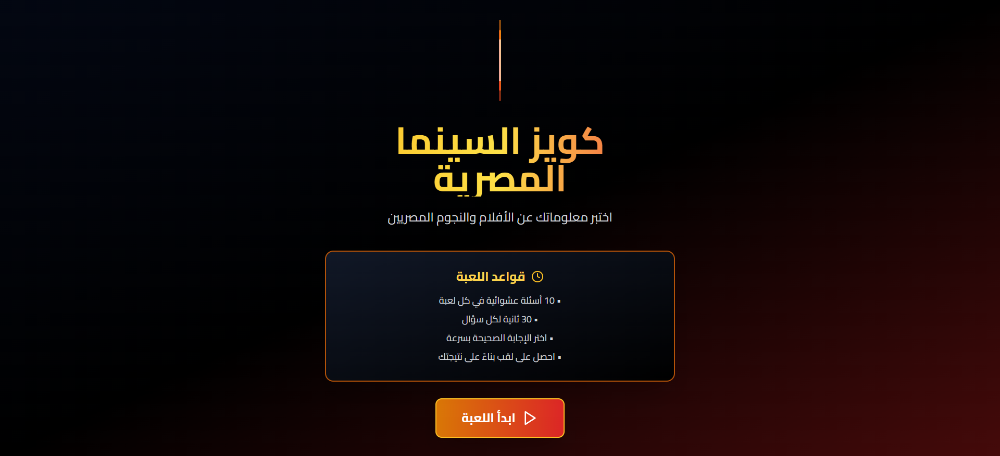

# Egyptian Cinema Quiz

A beautifully crafted, interactive quiz game celebrating the golden age of Egyptian cinema. Test your knowledge about legendary Egyptian actors, iconic movie quotes, and classic films through an engaging, timer-based challenge with stunning animations and a modern game-show aesthetic.

  

---

##  Features

- **Randomized Questions** — Each game presents a unique set of 10 questions randomly selected from a pool of 20+ Egyptian cinema questions
- **Timer Challenge** — 30 seconds per question to keep the adrenaline pumping
- **Animated Transitions** — Smooth, cinematic animations powered by Framer Motion for an immersive experience
- **Performance Titles** — Earn funny, context-aware titles based on your score (from "Cinema Legend" to "Need to Watch More")
- **High Score Tracking** — Your best performance is saved locally and displayed across sessions
- **Instant Feedback** — Visual animations show correct/incorrect answers immediately
- **Fully Responsive** — Optimized for mobile, tablet, and desktop screens
- **RTL Support** — Right-to-left layout with authentic Arabic typography (Cairo font)
- **Cinematic Design** — Gold, red, and black color scheme inspired by classic Egyptian cinema aesthetics

---

##  Tech Stack

| Technology | Purpose |
|------------|---------|
| **React 18** | Component-based UI framework |
| **TypeScript** | Type-safe development |
| **TailwindCSS** | Utility-first styling |
| **Framer Motion** | Smooth animations and transitions |
| **Vite** | Lightning-fast build tool |
| **Lucide React** | Beautiful, consistent icons |
| **LocalStorage API** | Persistent high score tracking |

---

##  Project Structure

```
egyptian-cinema-quiz/
├── src/
│   ├── components/
│   │   ├── QuestionCard.jsx    # Individual question display with answer options
│   │   ├── ResultCard.jsx      # Final score screen with performance title
│   │   └── Timer.jsx            # Countdown timer with visual progress bar
│   ├── data/
│   │   └── questions.js         # Question bank (20+ Egyptian cinema questions)
│   ├── utils/
│   │   └── shuffle.js           # Array shuffling and random selection utilities
│   ├── App.tsx                  # Main game logic and state management
│   ├── index.css                # Global styles and font imports
│   └── main.tsx                 # React entry point
├── public/                      # Static assets
├── package.json                 # Project dependencies
├── tailwind.config.js           # TailwindCSS configuration
└── vite.config.ts               # Vite build configuration
```

---

##  How to Run Locally

### Prerequisites
- Node.js (v16 or higher)
- npm or yarn

### Installation Steps

1. **Clone the repository**
   ```bash
   git clone <repository-url>
   cd egyptian-cinema-quiz
   ```

2. **Install dependencies**
   ```bash
   npm install
   ```

3. **Start the development server**
   ```bash
   npm run dev
   ```

4. **Open your browser**
   ```
   Navigate to http://localhost:5173
   ```

### Build for Production

```bash
npm run build
```

The optimized production build will be available in the `dist/` folder.

### Preview Production Build

```bash
npm run preview
```

---

##  How to Play

1. **Start Screen** — Click "ابدأ اللعبة" (Start Game) to begin
2. **Answer Questions** — You have 30 seconds per question to select the correct answer
3. **Watch Your Score** — Correct answers increase your score; wrong answers move to the next question
4. **View Results** — After 10 questions, see your score and performance title
5. **Play Again** — Challenge yourself to beat your high score!

### Performance Titles

| Score | Title | Emoji |
|-------|-------|-------|
| 100% | أسطورة السينما المصرية (Cinema Legend) 
| 80-99% | ناقد سينمائي محترف (Professional Film Critic) 
| 60-79% | عاشق السينما (Cinema Lover) 
| 40-59% | هاوي أفلام (Movie Hobbyist) 
| 20-39% | بداية الطريق (Starting the Journey)
| 0-19% | محتاج تتفرج أكتر (Need to Watch More) 

---

## Screenshots

### Home Page


---

##  Future Improvements

- [ ] **Difficulty Levels** — Easy, Medium, Hard modes with adjusted timer durations
- [ ] **Question Categories** — Filter by decade (60s, 70s, 80s, 90s) or genre (comedy, drama, action)
- [ ] **Sound Effects** — Audio feedback for correct/wrong answers and background music
- [ ] **Multiplayer Mode** — Challenge friends in real-time competitions
- [ ] **Online Leaderboard** — Global ranking system using Supabase
- [ ] **Achievements System** — Unlock badges for milestones (10 perfect games, 50 games played, etc.)
- [ ] **Share Results** — Social media integration to share scores
- [ ] **Expanded Question Bank** — 100+ questions covering more Egyptian cinema history
- [ ] **Hint System** — Use hints to eliminate wrong answers (limited per game)
- [ ] **Dark/Light Mode Toggle** — User preference for color scheme

## Acknowledgments

- Inspired by the rich history of Egyptian cinema
- Built with love for Arabic-language web applications
- Special thanks to the React and Framer Motion communities

---

##  Contact

Have questions or suggestions? Feel free to reach out!

- Email: Raniaabdelnasser93@gmail.com.com

---


